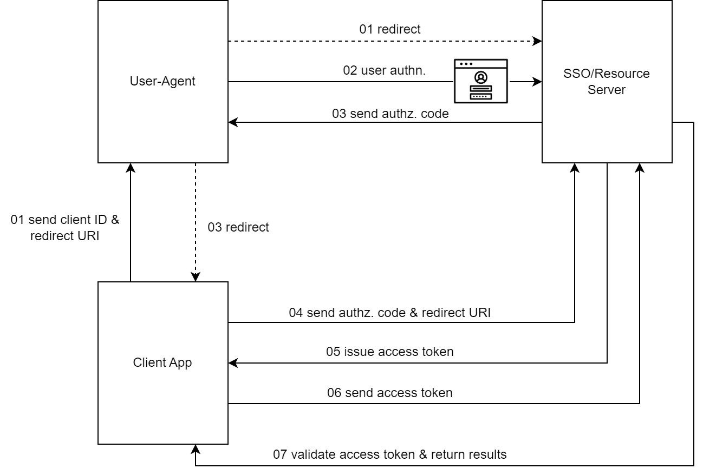

# OAuth 2.0 server and client

This project contains a OAuth 2.0 SSO server and a RBAC management web client. Implement by .NET Core 3.1 and C#.

## Table of Contents

- [Background](#background)
- [RBAC](#rbac)
- [Documentation](#documentation)
- [License](#license)

## Background

OAuth 2.0 is a standard protocol that enables a third-party application to obtain limited access to an HTTP service, either on behalf of a resource owner by orchestrating an approval interaction between the resource owner and the HTTP service, or by allowing the third-party application to obtain access on its own behalf. It prevent untrusted apps from accessing the organization's resources while allowing organization members to use OAuth apps for their personal accounts.

Here is the flowchart of the project:

And the architecture of the project: 

## RBAC

RBAC refers to role-based access control. It is a computer security approach that helps organizations manage the authorization of users easily.

Roles and permissions of an application/project are pre-defined in RBAC. Instead of directly assigned to users, permissions of an app are assigned to roles. Every user will then be assigned to one or multiple roles, at the same time acquire permissions via the roles he/she has.

## Documentation

[Here](./documentation.pdf)

## License

